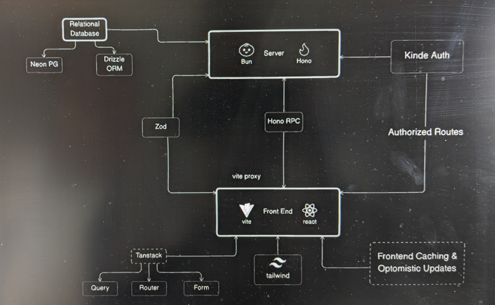

# bun-vite-react-pg

This project contains part following parts Bun, Hono, Zod, Vite, Shadcn



To install dependencies:

Go to https://bun.sh/ and install bun for you OS.
Then do the following:

```bash
bun install
```

To run:

```bash
bun run index.ts
```

This project was created using `bun init` in bun v1.1.7. [Bun](https://bun.sh) is a fast all-in-one JavaScript runtime.
